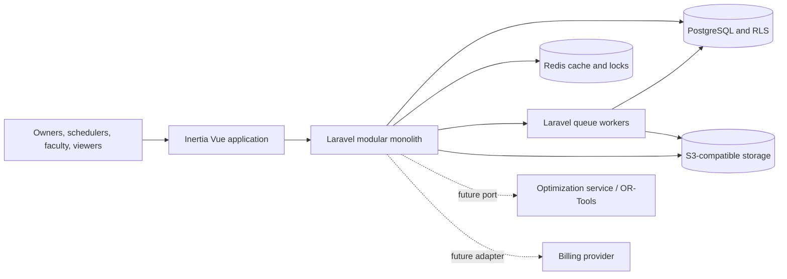
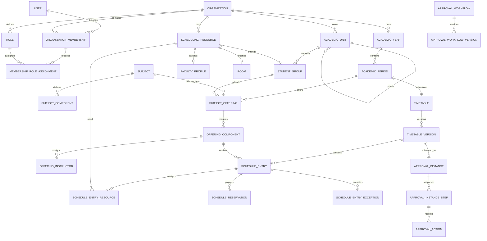

# Universal Timetable SaaS Architecture

## Summary

TalaSched is a subscription-based, organization-oriented timetable platform for institutions ranging from preschool to university. It is implemented as a Laravel 13 modular monolith with an Inertia Vue frontend, PostgreSQL, Redis, Laravel queues, S3-compatible storage, and PhpSpreadsheet.

The architecture uses one canonical schedule source to derive teacher, student-group, room, academic-unit, and organization-wide views. The first release supports manual scheduling, recurring weekly schedules with dated exceptions, conflict validation, immutable timetable versions, configurable approvals, controlled Excel templates, and provider-neutral subscription entitlements. Automatic scheduling is isolated behind a port for a later Laravel or OR-Tools implementation.

## Architectural Decisions

### Application and UI

- Use a modular monolith. Domain boundaries are enforced in code while deployment and operations remain simple.
- Use the existing Inertia Vue application for all product interfaces. Filament is not part of the application.
- Keep controllers and Inertia pages thin. Business behavior belongs in actions, policies, typed data objects, constraint handlers, and domain services.
- Use Wayfinder-generated route functions for all frontend-to-backend navigation and forms.

### Organizations and tenant isolation

- Rename the starter kit's Team domain to Organization and remove personal teams.
- A user can belong to multiple organizations; teachers join organizations through invitations and do not receive isolated personal school accounts.
- Subscriptions and capabilities belong to organizations.
- Use one shared PostgreSQL schema with `organization_id` on every organization-owned row.
- Use composite tenant-safe foreign keys, organization query scopes, scoped route binding, policies, and PostgreSQL row-level security as layered controls for domain tenant data.
- Treat memberships and invitations as identity control-plane tables because organization discovery and invitation acceptance occur before a single tenant context exists; keep them outside organization-only RLS and require actor- or organization-qualified application queries as defined by ADR 0003.
- The application database role must not have `BYPASSRLS`. Missing tenant context denies access.
- PostgreSQL 17 is the production database baseline. Runtime, owner, and migrator role privileges follow ADR 0004, and production readiness is verified with `php artisan database:verify-production`.
- HTTP actions, queue jobs, and CLI operations establish explicit tenant context before accessing domain tenant tables.

### Academic structure

- Model institution structure using organization-defined `academic_unit_types`, adjacency-list `academic_units`, allowed type edges, and an `academic_unit_closure` table.
- Provide presets for preschool, basic education, senior high school, and university, but persist ordinary editable records rather than hard-coded hierarchies.
- Model yearly schedulable cohorts as `student_groups`, attached to an academic unit and academic year. Do not store individual students in MVP.
- Support academic years and configurable academic periods using a `period_kind` enum containing semester, trimester, quarter, term, summer, and custom.

### Scheduling model

- Maintain one canonical organization-wide timetable per academic period.
- Derive teacher, group, room, department, program, and organization views from canonical schedule entries.
- Store recurring entries as weekday plus integer local-minute start/end values. Organization granularity validates allowed boundaries.
- Store cancellations, replacements, and reschedules as dated entry exceptions.
- Treat faculty, rooms, and student groups as scheduling resources through a common `scheduling_resources` identity.
- Project schedule assignments into `schedule_reservations` so PostgreSQL exclusion constraints can prevent overlapping resource bookings under concurrency.
- Use full immutable timetable-version snapshots. Publishing supersedes the previous version; rollback clones an older version into a new draft.

### Rules and automatic scheduling

- Implement behavior in registered constraint-handler classes.
- Store only validated, versioned handler configuration, scope, severity, priority, and weight in the database.
- Non-disableable hard constraints include resource overlap, operating hours, unavailability, room capacity and requirements, faculty load, and offering integrity.
- Soft constraints produce warnings and later optimization penalties.
- Define a framework-independent `SchedulingEngine` port using immutable `SchedulingProblem` and `GenerationResult` contracts.
- Generated schedules always become drafts and pass normal validation, approval, and publication.

### Approvals and signatories

- Version workflow definitions so edits never change an active or historical approval process.
- Snapshot ordered workflow steps when a timetable version is submitted.
- Store approval actions append-only.
- Snapshot signatory name, position, academic unit, and signature asset/checksum when approval occurs.
- MVP supports ordered configurable steps and minimum approver counts. Conditional graphs and parallel branches are postponed.

### Templates and subscriptions

- Use PhpSpreadsheet directly for Excel-template fidelity.
- Preserve uploaded workbooks and modify only explicitly mapped cells/ranges.
- Require controlled mapping for worksheet, timetable range, day columns, time rows, cell formatting, placeholders, and signatory slots.
- Process inspection, previews, and exports asynchronously; store private artifacts in S3-compatible storage.
- Represent plans through typed capabilities and integer limits. Application code uses entitlement and usage services rather than plan-name comparisons.
- MVP supports trials and manually managed subscription states. Payment collection remains behind a future billing-provider adapter.

## Runtime Architecture



## Modules and Data Ownership

### Identity and Organizations

- `organizations`: name, slug, public UUID, timezone, locale, scheduling granularity, owner, status.
- `organization_memberships`: unique organization/user membership and status.
- `organization_invitations`: hashed invitation token, normalized email, inviter, expiry, and requested roles.
- `roles`, `permissions`, `role_permissions`, `membership_role_assignments`: normalized organization permissions with optional academic-unit scope.

The owner is explicit on the organization and must also have an active membership. Ownership transfer is transactional. Built-in role templates include Owner, Administrator, Registrar, Scheduler, Department Head, Dean, Faculty, and Viewer. Custom role creation is capability-gated.

### Academic

- `academic_years`
- `academic_periods`
- `academic_unit_types`
- `academic_unit_type_edges`
- `academic_units`
- `academic_unit_closure`
- `academic_calendars`
- `calendar_exceptions`
- `student_groups`
- `student_group_periods`

Academic periods belong to years and must fit within their dates. Student groups are year-specific and can participate in one or more periods.

### Faculty, catalog, and offerings

- `scheduling_resources`
- `faculty_profiles`
- `faculty_unit_assignments`
- `subjects`
- `subject_components`
- `subject_component_room_types`
- `subject_component_features`
- `subject_offerings`
- `offering_components`
- `offering_instructors`

Subject defaults are copied into period-specific offering components so historical schedules remain stable. Teachers are assigned to offerings rather than permanently to subjects. Multiple instructors are supported without requiring them all to have application accounts.

### Rooms and availability

- `buildings`
- `room_types`
- `rooms`
- `features`
- `room_features`
- `resource_availability_rules`

Organization operating hours form the baseline. Explicit unavailable windows are hard blocks. If hard available windows exist for a resource/day, time outside them is unavailable. Preferred and avoid windows are soft constraints.

### Timetables

- `timetables`
- `timetable_versions`
- `schedule_entries`
- `schedule_entry_resources`
- `schedule_reservations`
- `schedule_entry_exceptions`
- `schedule_exception_resources`
- `saved_timetable_views`

Version states are `draft`, `in_review`, `changes_requested`, `approved`, `published`, and `superseded`. Only drafts and returned versions are editable. A publish transaction supersedes the current published version and promotes the approved replacement.

### Approvals

- `approval_workflows`
- `approval_workflow_versions`
- `approval_workflow_steps`
- `approval_step_roles`
- `approval_step_members`
- `approval_instances`
- `approval_instance_steps`
- `approval_actions`
- `signatory_profiles`
- `approval_signatory_snapshots`

### Templates, subscriptions, and audit

- `file_assets`, `excel_templates`, `excel_template_versions`, `template_mappings`, `export_runs`, `export_artifacts`
- `plans`, `capabilities`, `plan_capability_values`, `organization_subscriptions`, `organization_entitlement_overrides`, `usage_counters`, `subscription_events`
- `audit_events`

## Relationship Diagram



## Manual Scheduling Flow

1. Resolve organization context and active membership.
2. Authorize role and academic-unit scope; check subscription capability and limits.
3. Validate tenant-safe identifiers, offering/resource compatibility, granularity, and duration.
4. Begin a transaction and acquire sorted advisory locks for the version and resources.
5. Evaluate hard and soft constraint handlers.
6. Return structured HTTP 422 issues for hard conflicts and acknowledgement warnings for soft conflicts.
7. Insert the entry, resource assignments, and reservation projections.
8. Let PostgreSQL exclusion constraints provide the final race-safe overlap check.
9. Translate database constraint failures into the same conflict response contract.
10. Append audit events and dispatch notifications after commit.

Structured issues include a stable code, severity, field, resource identity, conflicting entry, rule code, translated message, and structured details.

## Concurrency and Database Enforcement

- Enable PostgreSQL `btree_gist`.
- Store recurring reservation ranges as half-open `int4range` values.
- Exclude overlapping ranges for the same organization, timetable version, resource, and weekday.
- Acquire organization/date/resource advisory locks when validating dated exceptions against recurring patterns.
- Use optimistic `lock_version` columns on mutable drafts and entries.
- Revalidate every hard constraint under a timetable-level lock before publishing.

## Excel Workflow

1. Upload and scan an `.xlsx` file.
2. Inspect it asynchronously and select a worksheet.
3. Map the timetable area, day columns, time rows, schedule-cell format, placeholders, and signatory slots.
4. Validate that each slot can be represented unambiguously.
5. Render and inspect a preview.
6. Save an immutable template version.
7. Clone the original workbook and modify only mapped cells during queued export.
8. Persist the generated artifact, checksum, source timetable version, and template version.

Macro-enabled files are rejected. Upload size, ZIP expansion, MIME, and scan status are enforced before parsing.

## Laravel Structure

```text
app/Modules/
  Organizations/
  Academic/
  Faculty/
  Catalog/
  Resources/
  Scheduling/
  Approvals/
  Templates/
  Subscriptions/
  Audit/
```

Modules use only the subdirectories they require: `Actions`, `Contracts`, `Data`, `Enums`, `Models`, `Policies`, `Queries`, `Rules`, `Services`, `Jobs`, and `Events`. Shared middleware/controllers remain under `app/Http`; Inertia pages remain under domain-grouped `resources/js/pages`.

Avoid generic repositories over Eloquent. Ports are reserved for billing, workbook processing/storage, and automatic scheduling.

## Important Constraints and Indexes

- Unique membership by organization/user and pending invitation by organization/normalized email.
- Organization-scoped uniqueness for employee number, subject code, academic-unit code, student-group code/year, and room code/building.
- Composite tenant-safe foreign keys on all child relationships.
- Academic date checks and hierarchy cycle prevention.
- One timetable per organization/period and one published version per timetable.
- Unique version sequence and entry logical UUID per version.
- GiST exclusion constraint for resource reservations.
- Availability indexes by resource, period, weekday, and effective dates.
- One active approval instance per timetable version.
- One current subscription per organization.
- Organization-first indexes for tenant query paths and time-oriented audit indexes.

## Delivery Scope

### MVP

- Organization refactor, invitations, normalized authorization, tenant RLS.
- Academic years/periods, custom hierarchy, calendars, and student groups.
- Faculty, subjects, offerings, rooms/features, and availability.
- Manual recurring scheduling, exceptions, conflict detection, and canonical views.
- Immutable versions, clone/compare, approval, publication, and rollback by cloning.
- Configurable sequential approvals and historical signatory snapshots.
- Controlled Excel templates and queued export.
- Provider-neutral capabilities, limits, trials, and manual subscription state.
- Audit events and operational metrics.

### V2

- Laravel-based automatic scheduling prototype and richer soft constraints.
- Bulk imports, workload reports, saved scenarios, and richer version comparison.
- Parallel or conditional approval branches.
- Billing-provider integration and advanced departmental proposal workflows.

### V3

- Python/OR-Tools optimization service if operational evidence justifies extraction.
- SSO/SAML, public API, SIS/LMS integrations, and webhooks.
- Individual student rosters and conflicts.
- Enterprise dedicated databases/data residency and collaborative editing.

## Implementation Order

1. Configure PostgreSQL, Redis, and S3-compatible storage.
2. Refactor Team to Organization and retain Fortify/passkey/2FA behavior.
3. Add tenant context, composite foreign keys, RLS, policies, and isolation tests.
4. Implement normalized roles, permissions, and academic-unit scope.
5. Implement academic calendars, hierarchy, and student groups.
6. Implement scheduling resources, faculty, rooms, availability, subjects, and offerings.
7. Implement timetable versions, entries, reservations, exceptions, constraints, and manual Vue UI.
8. Implement approval workflows, signatories, publication, comparison, and rollback.
9. Implement subscriptions, capabilities, usage limits, and audit.
10. Implement secure workbook mapping, previews, and exports.
11. Run tenant-isolation, concurrency, performance, backup/restore, and failure drills.
12. Start automatic scheduling only after representative production constraints exist.

## Verification and Acceptance

- Cross-tenant access fails through routes, guessed identifiers, raw SQL, queue jobs, exports, and signed URLs.
- Multi-organization users receive the correct role and academic-unit scope.
- Custom hierarchies work and cycles/invalid type edges fail.
- All academic period kinds work without semester-specific logic.
- Configured time granularities and variable durations are enforced.
- Faculty, room, group, availability, capacity, feature, and workload conflicts produce structured findings.
- Exactly one of two concurrent conflicting reservations succeeds.
- Dated cancellations/replacements/reschedules produce the correct effective schedule.
- Published versions cannot be edited through any application path.
- Workflow/signatory edits do not change historical approval records.
- Workbook fixtures retain mapped values, merges, styles, dimensions, images, and page setup.
- Capabilities and quotas cannot be bypassed through direct endpoints.
- Representative schedules meet latency targets and exports remain asynchronous.

## Risks and Assumptions

- Universal hierarchy semantics are controlled through unit types, permitted type edges, presets, and separate student groups.
- Weekly recurrence is the only repeating rule in MVP; entries cannot cross midnight.
- Excel templates use controlled mapping and explicitly reject unsupported layouts.
- Approval workflows remain ordered in MVP rather than becoming a general workflow engine.
- Full version snapshots intentionally trade storage for reliable audit, comparison, rollback, and export.
- Student identity, attendance, grading, enrollment, payroll, and learning-management features are outside MVP.
- Organization timezones use IANA identifiers and persisted timetable times are local wall-clock minutes.
- Payment collection is deferred, but all capabilities and usage limits are enforced through the provider-neutral entitlement layer.
